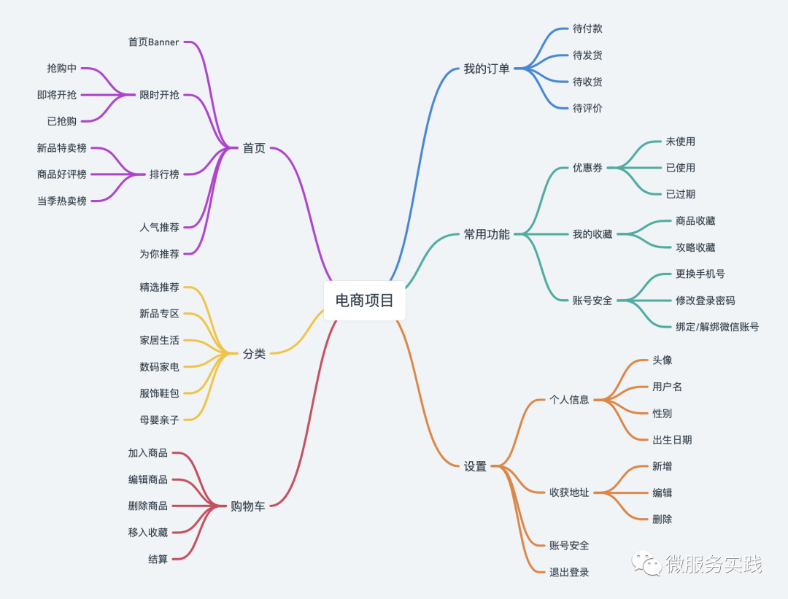

# shop-demo
跟着go-zero官方的demo录一个简单商城-主要是微服务架构的

### 项目整体概述
****
 * 服务划分
   1. 架构图
     
     
 * 目录
    1. 商品服务(product)-商品的添加、信息查询、库存管理等功能
    2. 购物车服务(cart)-购物车的增删改查
    3. 订单服务(order)-生成订单、订单管理
    4. 支付服务(pay)-通过调用第三方支付实现支付功能
    5. 账号服务(user)-用户信息、等级、封禁、地址管理
    6. 推荐服务(recommend)-首页商品推荐
    7. 评论服务(reply)-商品的评论功能、评论的回复功能
    8. 登陆服务(login)-生成登陆和退出、日志和token的生成
 * 工程结构
```
shop-demo
|
|
└─── apps
|      │
|      └─── app
|      |     └─── api
|      └─── cart
|      |     └─── admin
|      |     └─── rmq
|      |     └─── rpc   
|      |
|      └─── order
|      |     └─── admin
|      |     └─── rmq
|      |     └─── rpc  
|      |
|      └─── pay
|      |     └─── admin
|      |     └─── rmq
|      |     └─── rpc  
|      |
|      └─── product
|      |     └─── admin
|      |     └─── rmq
|      |     └─── rpc  
|      |
|      └─── recommend
|      |     └─── rpc  
|      |
|      └─── reply
|      |     └─── admin
|      |     └─── rmq
|      |     └─── rpc  
|      |
|      └─── user
|      |     └─── admin
|      |     └─── rmq
|      |     └─── rpc        
|      └─── login
|      |     └─── admin
|      |     └─── rmq
|      |     └─── rpc 
└─── pkg
|   go.mod
│   README.md
│   LICENSE    

```

* 代码初始化
* grpc调试工具
    1. 官方推荐 使用grpcurl工具进行
    2. BloomRPC GUI工具 [下载地址](https://github.com/bloomrpc/bloomrpc)
