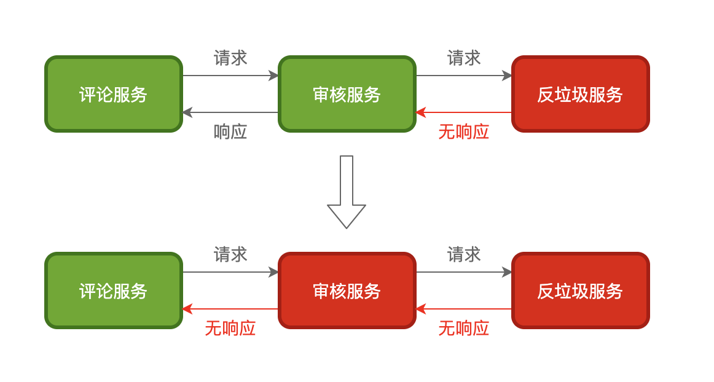
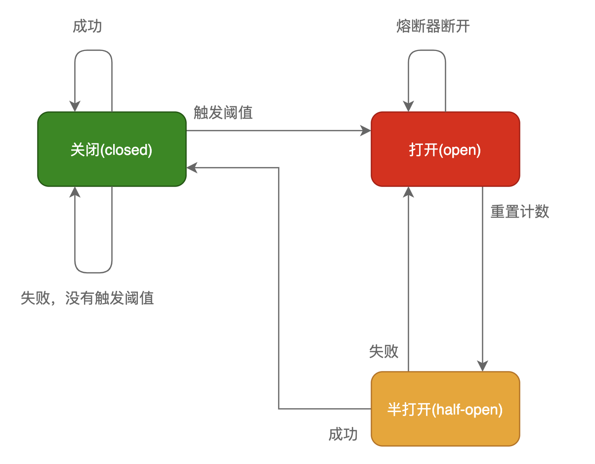

# 熔断原理与实现

背景：
    在微服务中服务间的依赖非常常见，比如评论服务依赖审核服务，而审核服务又依赖反垃圾服务，当评论服务调用审核服务时
，审核服务又调用反垃圾服务；而这时反垃圾服务超时响应；由于审核服务依赖反垃圾服务，导致审核服务也出现超时
；导致审核服务一直等待，而这个时候的评论服务又一直调用审核服务，审核服务就有可能因为堆积了大量请求而导致服务宕机；

结论：
    由此可见，在整个调用链中，中间的某一个环节出现异常就会引起上游调用服务出现一系列的问题，甚至
导致整个调用链的服务都宕机，这是非常可怕的。因此一个服务作为调用方调用另一个服务时，为了防止被调用服务
出现问题导致调用服务出现问题；所以调用服务需要进行自我保护，而保护的手段就是熔断。


## 熔断器原理
熔断机制其实是参考了我们日
常生活中的保险丝的保护机制，当电路超负荷运行时，
保险丝会自动的断开，从而保证电路中的电器不受损害。而服务治理中的熔断机制，
指的是在发起服务调用的时候，如果被调用方返回的错误率超过一定的阈值，
那么后续将不会真正地发起请求，而是在调用方直接返回错误

在这种模式下，服务调用方为每个调用服务（调用路径）维护一个状态机，在这个状态机中有三个状态
+ 关闭(closed)
    + 在这种状态下,我们需要一个计数器来记录调用失败的次数和总的请求次数，如果在某个时间窗口内，
失败的失败率达到预订的阈值，则切换到断开状态；此时开启一个超时时间,当到达该时间则切换到半关闭状态，该超时时间是给了系统一次机会来修正导致调用失败的错误，以回到正常的工作状态。在关闭状态下，调用错误是基于时间的，
在特定的时间间隔内会重置，这能够防止偶然错误导致熔断器进入断开状态
+ 打开(open)
  + 在该状态下，发起请求时会立即返回错误，一般会启动一个超时计时器，当计时器超时后，状态切换到半打开状态，也可以设置一个定时器，定期的探测服务是否恢复
+ 半打开（half-open）
  + 在该状态下，发起请求时会立即返回错误，
一般会启动一个超时计时器，当计时器超时后，状态切换到半打开状态，
也可以设置一个定时器，定期的探测服务是否恢复；

    服务治理中引入熔断机制，使得系统更加稳定和有弹性，在系统从错误中恢复的时候提供稳定性，并且减少了错误对系统性能的影响，
可以快速拒绝可能导致错误的服务调用，而不需要等待真正的错误返回
```go
func BreakerInterceptor(ctx context.Context, method string, req, reply interface{},
    cc *grpc.ClientConn, invoker grpc.UnaryInvoker, opts ...grpc.CallOption) error {
  // 基于请求方法进行熔断
    breakerName := path.Join(cc.Target(), method)
    return breaker.DoWithAcceptable(breakerName, func() error {
    // 真正发起调用
        return invoker(ctx, method, req, reply, cc, opts...)
    // codes.Acceptable判断哪种错误需要加入熔断错误计数
    }, codes.Acceptable)
}
```
## 总结
调用端可以通过熔断机制进行自我保护，
防止调用下游服务出现异常，
或者耗时过长影响调用端的业务逻辑，
很多功能完整的微服务框架都会内置熔断器。
其实，不仅微服务调用之间需要熔断器，在调用依赖资源的时候，
比如mysql、redis等也可以引入熔断器的机制。